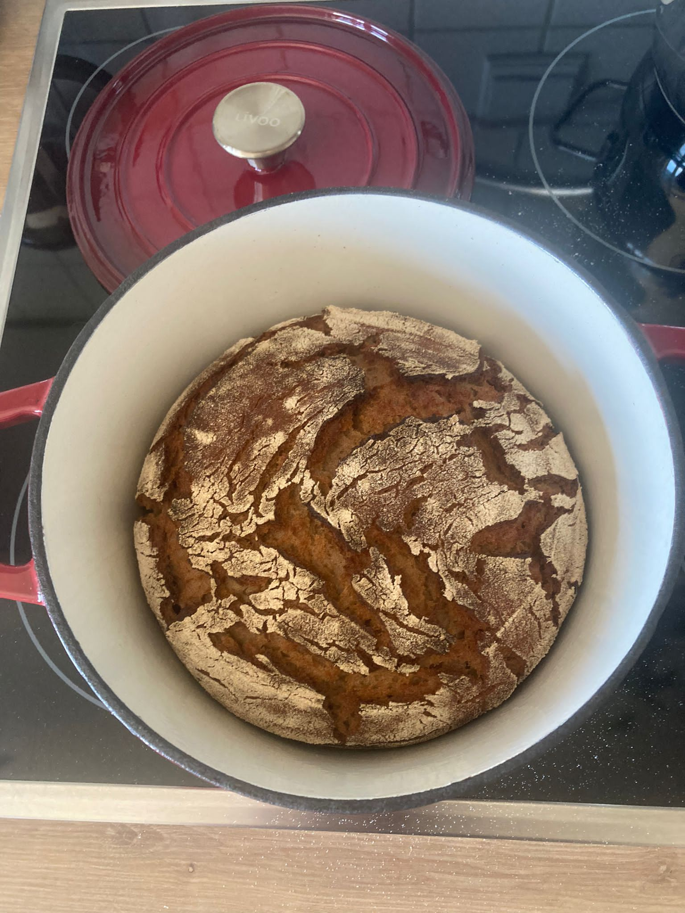

====
Brot
====

Zutaten:
========

Erster Schritt:
---------------

Anstellgut (Roggen) aus dem Kühlschrank hohlen. 40g mit 20g Roggenmehl und 20g lauwarmem Wasser glatt rühren. Deckel darauf, aber nicht luftdicht schließen.  12-24 Stunden stehen lassen. Temperatur: bitte selber einlesen. Kalt geführt wird er säuerlicher, warm geführt milder und großporiger. Am besten zwieschen 25°C und 30°C.

Zweiter Schritt:
----------------

   width: 500

Aktiviertes Anstellgut, schön großporig.

   
40g vom Anstellgut mit 150g Roggenvolkornmehl und 150g Wasser zum Sauerteig verrühren.
Anschließend abdecken und bis zum nächsten morgen warm stellen. 

   
Dritter Schritt:
----------------

   
Bevor die anderen Zutaten dazu gegeben werden, ein Löffelchen abnehmen und in den Kühlschrank.
Dies ist das Anstellgut für das nächste Brot. 

Vierter Schritt:
----------------

   
500g Mehl (kann rein Roggen bleiben) und 300g lauwaremes Wasser, sowie 14g Salz mit dem Sauerteig vermengen. Wenn alles glatt vermischt ist, den Teig für 2-4 Stunden warm stellen.

.. image:: bilder/schritt7.jpg

Fünfter Schritt:
----------------

Aus dem Teig einen Leib formen (dies kann mit Roggen-Teig schwierig sein). und ab ins gut gemehlte Körbchen.
Diesen dann nochmals 1-2 Stunden ruhen lassen. 

Sechster Schritt:
-----------------

Den Leib in einen vorgeheizten Topf. Diesen mit Deckel in den vorgeheizten Ofen (Ober-/Unterhitze 250°C).
Bei 250°C für 25 Minuten backen. Anschließend für 25 Minuten bei 220 und abschließend für 10 Minuten bei 200°C blacken. 

   
Sieber Scritt:
--------------

Das Brot abkühlen lassen und fertig.

